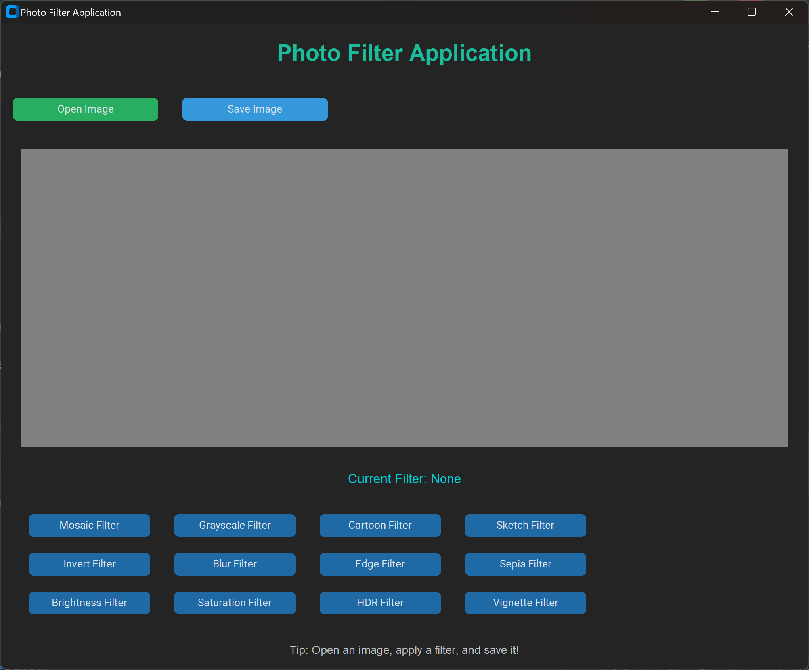

<p align="center">
  <h1>Applying Filters such as Mosaic to Photos with OpenCV</h1>
</p>

<p align="center">
  
  
  
</p>


# 24OSS-Group26  
**Applying Filters such as Mosaic to Photos with OpenCV**

## Project Overview
This repository is dedicated to the Group 26 term project for the **Open Source Software Course, 2024**, at **Gachon University**. Our project involves applying various filters, such as mosaic effects, to photos using OpenCV. Through this project, we aim to explore image processing techniques in an open-source context.

## Team Members
| Name    | GitHub Profile                                         | Email                                                |
|---------|--------------------------------------------------------|------------------------------------------------------|
| 송영빈   | [](https://github.com/songyb111-gachon) |  |
| 박준우   | [](https://github.com/cire21st)               |   |
| 조수연   | [](https://github.com/yeun23)                   |  | 


## Project Structure
The directory structure for this repository is as follows:

<pre>
24OSS-Group26/
├── src/
│   ├── filters/                  # Contains Python scripts for each filter
│   │   ├── blur.py               # Blur filter
│   │   ├── brightness.py         # Brightness adjustment filter
│   │   ├── cartoon.py            # Cartoon filter
│   │   ├── edge_detection.py     # Edge detection filter
│   │   ├── grayscale.py          # Grayscale filter
│   │   ├── hdr_effect.py         # HDR effect filter
│   │   ├── invert.py             # Invert colors filter
│   │   ├── mosaic.py             # Mosaic (pixelation) filter
│   │   ├── saturation.py         # Saturation adjustment filter
│   │   ├── sepia.py              # Sepia tone filter
│   │   ├── sketch.py             # Sketch effect filter
│   │   └── vignette.py           # Vignette effect filter
│   └── main.py                   # Main script for filter selection and application
├── test_img/                     # Directory containing sample images
├── .venv/                         # Virtual environment directory
├── requirements.txt              # List of dependencies (Python and OpenCV)
├── README.md                     # Project documentation
└── LICENSE                       # License information
</pre>

- **`src/filters/`**: Contains Python scripts for various image processing filters like blur, brightness adjustment, cartoon effect, etc.
- **`src/main.py`**: The main script that allows users to apply the filters.
- **`test_img/`**: A directory for storing sample images to demonstrate the effects of the filters.
- **`.venv/`**: Virtual environment to manage dependencies.
- **`requirements.txt`**: A file that lists all required Python libraries for the project.
- **`README.md`**: This file, which provides project details and instructions.
- **`LICENSE`**: Contains the open-source license details for the project.


## Getting Started

1. **Clone the Repository**  
   Clone this repository to your local machine:
   ```bash
   git clone https://github.com/24OSS-Group26/24OSS-Group26.git
   ```
   
2. **Navigate to the Project Directory**  
   Change to the project directory:
   ```bash
   cd 24OSS-Group26
   ```

3. **Install Dependencies**  
   Install the required libraries (Python 3.12 and OpenCV):
   ```bash
   pip install -r requirements.txt
   ```

4. **Run the Application**  
   Navigate to the `src` folder and run `main.py` to start applying filters:
   ```bash
   cd src
   python main.py
   ```

## Features
- **Mosaic Filter**: Apply a pixelation effect to blur parts or all of an image.
- **Additional Filters**: Explore more effects such as grayscale, sepia, and more.

## Usage
Run the `main.py` script in the `src` folder to select and apply various filters to images. Follow the instructions in the script for filter selection and intensity adjustment.

## Screenshot Example
Here are example images after applying the filter:

<p align="center">
  
  
  
</p>

